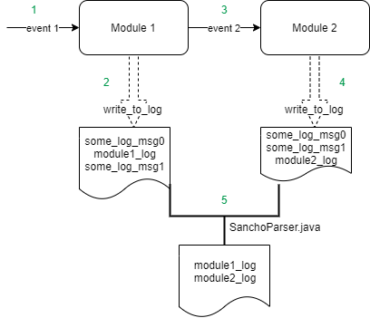

####Motivation
When I was working on telecom company I used to handle
integration testing. Huge part of it was analyzing
the logs of several modules. To make this work easier
this java tool **SanchoParser** was created.

####What this tool does?
1. The **event1** comes into **Module 1**
2. **Module 1** writes specific log message
3. **Module 1** generates **event2** for **Module 2** 
4. **Module 2** writes specific log message
5. **SanchoParser** aggregates log messages by predefined regex,
sorts them according to timestamp and prints it into stdout

####Further usage
**SanchoParser** was presented to colleagues and integrated into test pipeline.